<p align="center">
  
</p>

<a name="index"></a>

<details>
<summary><code>$ less --plain</code></summary>

```text
~/research
├── debtwatch/
├── ai-bubblewatch/
├── culture-legitimacy/
├── ECIS           RESTRICTED
├── GEN_ALPHA.dat
└── autonomous-security/
```

</details>

`cd` → [debtwatch](#debtwatch) · [ai-bubblewatch](#ai-bubblewatch) · [culture-legitimacy](#culture-legitimacy) · [GEN_ALPHA.dat](#gen-alpha) · [autonomous-security](#autonomous-security) · [mind.cache](#mind-cache) · [market.frequencies](#market-frequencies) · [library](#library)

<a name="operator-note"></a>

<details>
<summary><code>$ less --plain</code></summary>

```text
I build things to understand
them. Most of my questions start
somewhere between markets,
companies, AI and philosophy,
then refuse to stay in one
category.

I'm interested in how money
moves, how companies acquire
power, how technology becomes
culture, and what would make a
convincing explanation fall
apart. Sometimes that turns into
code. Sometimes it becomes a
research dossier with more
unanswered questions than I
started with.

My working environment is mostly
terminals, agents, source
material and repeated revisions.
I'm still learning the technical
side as I go. This node collects
the projects, ideas and strange
corners of the internet that
keep me coming back.
```

</details>

<a name="debtwatch"></a>

<details>
<summary><code>$ less --plain</code></summary>

```text
DEBTWATCH         credit-console
────────────────────────────────
snapshot  2026-10-02  HISTORICAL
evidence  to 2026-10-01
edition   2026-10-03
mode      research / monitoring
forecast  none

Q  when does expensive credit
   become unavailable credit?
```

```text
transmission  (conceptual)
macro → rates → credit pricing
      → refinancing
      → company cash flows

# not an automatic sequence:
# maturities, fixed vs floating
# rates, collateral, lender
# appetite and operating
# performance change the path
```

```text
┌────────┬─────────────────────┐
│ LAYER  │ WHAT IT OBSERVES    │
├────────┼─────────────────────┤
│ PRICE  │ cost of borrowing   │
│ TERMS  │ more security,      │
│        │ tighter restrictions│
│ ACCESS │ can it be obtained? │
└────────┴─────────────────────┘
```

```diff
@@ snapshot 2026-10-02 @@
+ pricing: pressure more evident
+ terms: selective deterioration
- access: broad failure not
-   established
```

```text
notes
> successful refinancings stay
  in the record as
  counterevidence
> the borrower panel was picked
  after spotting cases of
  interest: no estimate of how
  much of the market is losing
  access
> not a claim about conditions
  today

result  NOT YET
> the evidence hasn't crossed
  the threshold for the
  stronger conclusion. it
  doesn't mean no risk exists.

research / monitoring workflow
not a crash predictor
```

</details>

[`$ cat public/debtwatch-public-brief.md`](public/debtwatch-public-brief.md)

<a name="ai-bubblewatch"></a>

<details>
<summary><code>$ less --plain</code></summary>

```text
AI BUBBLEWATCH       observatory
────────────────────────────────
cutoff      2026-09-21
hypothesis  unresolved
sample      16 selected entities
            not representative
verdict     none

Q  what would distinguish
   durable investment from an
   unsustainable buildout?
```

```ini
; the name is a question,
; not a verdict

[capex]
  announced, spent and
  committed are different
  quantities
[utilization]
  contracted capacity is not
  realized, profitable use
[returns]
  revenue or usefulness alone
  is not a return above the
  cost of capital
[obligations]
  debt, project obligations,
  leases and customer
  commitments: separate
[financing]
  access to new money doesn't
  settle the economics of what
  it pays for
```

```diff
@@ counterevidence @@
+ priced financing activity
+   works against "capital
+   markets have closed"
- by itself it proves nothing
-   about lifetime returns
```

```text
open
 · mature-cohort returns
 · contracted vs realized use
 · renewal, durable demand
 · demand that depends on
   continuing financing
 · who bears the risk

no bubble verdict
no live market assessment
no trading recommendation
```

</details>

[`$ cat public/ai-bubblewatch-public-brief.md`](public/ai-bubblewatch-public-brief.md)

<a name="culture-legitimacy"></a>

<details>
<summary><code>$ less --plain</code></summary>

```text
.
├── index.md
├── production/
├── reception/
├── causal-question/     OPEN
└── reports/
    ├── informe-sencillo  10pp
    └── informe-formal    13pp

4 directories, 3 files
# reports in ES (Spanish)
```

```text
TASTEWASHING →
CULTURAL LEGITIMACY EMBEDDING
(working title)
────────────────────────────────
status  documentary research
        pre-experimental
causal  OPEN
cutoff  2026-08-12
```

```text
why are technology and defense-
tech companies becoming cultural
objects through clothing,
design, events, communities and
identity?

the comparisons made the
original explanation less
simple. similar practices appear
in ordinary software businesses;
traditional defense companies
already have histories of
national, professional and
community identification.
audiences read the same object
as aesthetics, career ambition,
investment, fandom, irony or
political affinity.
```

```ini
[production]
  what do companies make,
  communicate and organize?
  ! visible branding does not
    establish a concealed
    intention
[reception]
  how do people interpret or
  use those cultural objects?
  ! selected public comments
    cannot estimate
    population-wide attitudes
[causal-question]
  does affinity change the
  legitimacy granted to a
  company's functions or power?
  ! liking a brand is not
    evidence that this
    transition occurred
```

```text
the reports do not establish
that causal link. connections
between organizations don't
alone show coordination; an
effect, even if established,
wouldn't prove intention.
"cultural legitimacy embedding"
is a working title, not a
validated theory.
```

</details>

`start here` → [Tastewashing, cultura y poder tecnológico](public/Tastewashing_Informe_Sencillo_PUBLIC_v1.pdf) · `PDF · ES · 10 pages`<br>
`full synthesis` → [De tastewashing a la legitimidad cultural del poder tecnológico](public/Tastewashing_Informe_Formal_PUBLIC_v1.pdf) · `PDF · ES · 13 pages`

[`$ cat public/culture-legitimacy-public-index.md`](public/culture-legitimacy-public-index.md)

<details>
<summary><code>$ cat reports/README</code></summary>

```text
both reports keep the 12 August
2026 research cutoff, their pre-
experimental status and their
disclosure of AI assistance in
search, comparison, synthesis
and adversarial review.

public editions are dated 3
October 2026: an editorial
preparation date, not a new
research cutoff. the research
bodies are preserved and the
bibliography updated.

social-media threads remain
qualitative, non-representative
examples. live corporate pages
may have changed since the
cutoff and are not archived
evidence of every earlier
formulation.
```

</details>

<p align="center">
  
</p>

<a name="mind-cache"></a>

<details>
<summary><code>$ less --plain</code></summary>

```text
01  what would make me change
    my mind?
    > the question i try to ask
      before an answer gets
      comfortable. a habit,
      not a badge.

02  when does authority become
    legitimate?
    > political philosophy, but
      also companies and
      institutions, and why
      people accept the power
      they hold.

03  who gets to define normal?
    > language, norms, culture,
      and the way every
      generation judges the
      next one.

04  how much of identity is
    actually ours?
    > the question underneath a
      lot of the fiction in
      ~/library: memory,
      belonging, consciousness,
      change.

05  why do markets believe what
    they believe?
    > a price is a story with
      money behind it. where
      does the story come from?
```

</details>

<a name="gen-alpha"></a>

<details>
<summary><code>$ less --plain</code></summary>

```text
# cohort / cognition archive
# source snapshot 2026-08-16
# a label, not a dataset

Q  what actually changes between
   generations, and what changes
   in the comparison?
```

```text
-[ RECORD 1 ]-------------------
domain | educational
       | performance ≠
       | general cognition
note   | reading, maths and
       | science tests measure
       | abilities in defined
       | settings; not a direct
       | measure of attention,
       | working memory or
       | independent judgment
-[ RECORD 2 ]-------------------
domain | population · age ·
       | measure
note   | which group, task,
       | country, period? PISA
       | 2022 tested
       | 15-year-olds, mostly
       | born well before the
       | usual Gen Alpha start
       | dates
-[ RECORD 3 ]-------------------
domain | school conditions
note   | instruction,
       | attendance, pandemic
       | disruption,
       | socioeconomic and
       | language context
-[ RECORD 4 ]-------------------
domain | screens · short-form
       | · feeds · ai
note   | separate hypotheses,
       | separate causal
       | evidence. association
       | ≠ direction;
       | uncertainty ≠ harmless
-[ RECORD 5 ]-------------------
domain | the observer
note   | biased memory makes
       | "kids these days" look
       | worse; dismissing a
       | documented decline is
       | also an error

(5 rows)
```

```text
the reviewed material supports
a heterogeneous picture. "an
entire generation is declining"
is a much larger claim than the
evidence behind one educational
trend.

causality  UNRESOLVED
research   open
type       selected public note
           not a systematic
           review, dataset or
           experiment
```

</details>

[`$ cat public/gen-alpha-research-note.md`](public/gen-alpha-research-note.md)

<a name="autonomous-security"></a>

<details>
<summary><code>$ less --plain</code></summary>

```text
[mode  ] discovery
[mode  ] adversarial review
[scope ] security boundaries
         for increasingly
         autonomous action
[method] compare proposed
         approaches with
         existing research
         and tools
[check ] novelty claims:
         under falsification
[check ] protection claims:
         under falsification
[result] no validated primitive
[result] no validated product
[result] no startup thesis
[note  ] an interesting
         question is not yet a
         defensible contribution
```

</details>

[`$ cat public/autonomous-systems-security-public-note.md`](public/autonomous-systems-security-public-note.md)

<a name="market-frequencies"></a>

<details>
<summary><code>$ less --plain</code></summary>

```ini
; interests and questions,
; not positions or advice

[crypto]
topics = bitcoin, solana,
         memecoins
lens   = liquidity, incentives,
         coordination, narrative

[equities]
topics = banks, software, ai,
         defense-tech
lens   = capital, market power,
         dependence

[credit]
topics = obligations,
         maturities, refinancing
note   = the interest behind
         debtwatch

[structure]
topics = liquidity, market
         structure
q      = what can a price
         actually tell you?

[narrative]
q      = why does a story
         become believable once
         money enters it?

; no wallets · no balances
; no p&l · not advice
```

</details>

<a name="library"></a>

<details>
<summary><code>$ less --plain</code></summary>

```yaml
# an orbit of works,
# not a reading log
books:
  dune: power, prescience
  leviathan: authority, order
  "1984": language, control
  fahrenheit_451: distraction
  brave_new_world: conditioning
  the_road: moral continuity
  cadaver_exquisito: normality
fiction:
  monster: responsibility
  edgerunners: identity, systems
  angel_beats: memory, loss
  charlotte: bonds, continuity
myth:
  norse: fate, transformation
```

</details>

<a name="operator-environment"></a>

<details>
<summary><code>$ less --plain</code></summary>

```sh
# grouped by use
# no mastery bars
build=(claude-code git vscode)
build+=(python)
research=(chatgpt sources)
screens=(tradingview reuters)
screens+=(coinglass)
crypto=(axiom phantom)

# a tool used ≠ a skill claimed
mastery=undefined

# most building happens in a
# terminal with agents: direct
# the task, compare answers,
# review the result, revise.
```

</details>


<details>
<summary><code>$ less --plain</code></summary>

```text
minecraft/      terraria/
weird-corners-of-the-internet/
technical-rabbit-holes/
too-many-tabs.txt
```

</details>

<p align="center">
  
</p>

<p align="center"><a href="#index"><code>cd ~/research</code></a></p>
