

  

  

I build things to understand them. Most of my questions start somewhere between markets, companies, AI and philosophy, then refuse to stay in one category.

I'm interested in how money moves, how companies acquire power, how technology becomes culture, and what would make a convincing explanation fall apart. Sometimes that turns into code. Sometimes it becomes a research dossier with more unanswered questions than I started with.

My working environment is mostly terminals, agents, source material and repeated revisions. I'm still learning the technical side as I go. This node collects the projects, ideas and strange corners of the internet that keep me coming back.

  

**Public files** → [DebtWatch](#debtwatch) · [AI BubbleWatch](#ai-bubblewatch) · [Culture / Legitimacy](#culture-legitimacy) · [GEN_ALPHA.dat](#gen-alpha) · [Autonomous Systems Security](#autonomous-systems-security) 
**Restricted** → ECIS · PRIVATE R&D SYSTEM

*Every status here is written as a word, not a color. Dates are research cutoffs, not live updates.*

  

`MACRO / CREDIT RESEARCH` · `historical snapshot 2026-10-02`

**When does expensive credit become unavailable credit?**

DebtWatch follows how macro pressure reaches credit markets and individual companies: financing costs, refinancing conditions, borrower stress and the evidence that connects them. The path runs from macro conditions through rates and credit pricing to refinancing and company cash flows, but it is not an automatic sequence. Maturities, fixed versus floating rates, collateral, lender appetite and operating performance all change how pressure travels.

The distinction I keep returning to is **price vs. terms vs. access**. One borrower refinances at a higher cost. Another gets funds only after accepting more security or tighter restrictions. A third can't get the financing it needs. Those are different observations, and they should stay separate.

At its historical snapshot, the reviewed material pointed to pressure that was more evident in pricing, with selective deterioration in terms, while a broad failure of access had not been established. The borrower panel was selected after spotting cases of interest, so it can't estimate how much of the market is losing access. Successful refinancings stay in the record as counterevidence. None of this is a claim about conditions today.

This is a research and monitoring workflow, not a crash predictor. **"Not yet"** is a valid result: the evidence hasn't crossed the threshold for the stronger conclusion. It doesn't mean no risk exists.

[`$ cat public/debtwatch-public-brief.md`](public/debtwatch-public-brief.md) — read the public brief

  

`AI ECONOMICS RESEARCH` · `historical cutoff 2026-09-21`

**What would distinguish durable investment from an unsustainable buildout?**

AI BubbleWatch examines the economics behind the AI buildout: capital expenditure, utilization, returns, obligations and the financing arrangements that keep expansion moving. The name is a question, not a verdict.

- **Investment / CAPEX** — announced spending, cash spent and future commitments are different quantities.
- **Utilization** — contracted capacity is not necessarily realized, profitable use.
- **Returns** — revenue growth or a useful product doesn't, on its own, establish returns above the cost of capital.
- **Obligations** — company debt, project obligations, leases and customer commitments need separate treatment.
- **Financing** — access to new money doesn't settle the economics of the assets it pays for.

Financial stress, access to new capital and weak investment returns are different observations. The reviewed snapshot included financing activity that works against a blanket "capital markets have closed" claim, and that same evidence says nothing by itself about lifetime returns. Counterevidence stays in the argument. Unresolved economics stay unresolved.

The snapshot covered 16 deliberately selected entities, not a representative sample of the AI economy. No bubble verdict, no live market assessment, no trading recommendation.

[`$ cat public/ai-bubblewatch-public-brief.md`](public/ai-bubblewatch-public-brief.md) — read the research note

  

`DOCUMENTARY RESEARCH` · `PRE‑EXPERIMENTAL` · `CAUSAL QUESTION OPEN`

**Tastewashing → Cultural Legitimacy Embedding** *(working title)*

This started with an apparently small question: why are technology and defense-tech companies becoming cultural objects through clothing, design, events, communities and identity?

The comparisons made the original explanation less simple. Similar practices appear in ordinary software businesses, and traditional defense companies already have histories of national, professional and community identification. Meanwhile, audiences can read the same object as aesthetics, career ambition, investment, fandom, irony or political affinity.

Three layers stay separate:

- **Production** — what do companies make, communicate and organize?  *Visible branding does not establish a concealed intention.*
- **Reception** — how do people interpret or use those cultural objects?  *Selected public comments cannot estimate population-wide attitudes.*
- **Causal question** — does affinity change the legitimacy granted to a company's functions or power?  *Liking a brand is not evidence that this transition has occurred.*

The reports do not establish that causal link. Connections between organizations don't alone demonstrate coordination, and an effect, even if established, wouldn't automatically prove intention. "Cultural Legitimacy Embedding" is a working title for the broader inquiry, not a validated theory.

**Start here** → [Tastewashing, cultura y poder tecnológico](public/Tastewashing_Informe_Sencillo_PUBLIC_v1.pdf) 
accessible report · PDF · `ES · 10 pages`

**Full documentary synthesis** → [De tastewashing a la legitimidad cultural del poder tecnológico](public/Tastewashing_Informe_Formal_PUBLIC_v1.pdf) 
formal report · PDF · `ES · 13 pages`

[`$ cat public/culture-legitimacy-public-index.md`](public/culture-legitimacy-public-index.md) — explore the research

<b>About these public editions</b>

 

Both reports keep the **12 August 2026 research cutoff**, their pre-experimental status and their disclosure of AI assistance in search, comparison, synthesis and adversarial review. The public editions are dated 3 October 2026; that is an editorial preparation date, not a new research cutoff.

The public editions preserve the research bodies and update the bibliography. Social-media threads remain qualitative, non-representative examples. Live corporate pages may have changed since the historical cutoff and are not archived evidence of every earlier formulation.

  

  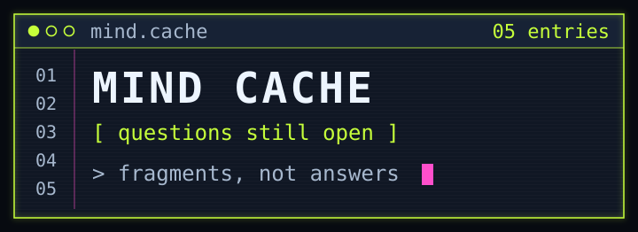

**What would make me change my mind?** 
The question I try to ask before an answer gets comfortable. A habit, not a badge.

**When does authority become legitimate?** 
Political philosophy, but also companies and institutions, and why people accept the power they hold.

**Who gets to define normal?** 
Language, norms, culture, and the way every generation judges the next one.

**How much of identity is actually ours?** 
The question underneath a lot of the fiction further down: memory, belonging, consciousness, change.

**Why do markets believe what they believe?** 
A price is a story with money behind it. I want to know where the story comes from.

  

`ONGOING RESEARCH` · `source snapshot 2026-08-16`

**What actually changes between generations, and what changes in the comparison?**

This began with claims that younger generations are becoming less capable. I want to know which concerns survive careful comparison, which are specific to a population or measure, and which depend on remembering the past too generously. The reviewed material supports a heterogeneous picture. That doesn't make every concern unfounded; it means "an entire generation is declining" is a much larger claim than the evidence behind a particular educational trend.

- **Educational performance ≠ general cognition.** Reading, mathematics and science assessments measure important abilities in defined settings. They are not a direct measure of attention, working memory, social skills or independent judgment.
- **Population, age, measure.** Which group, which task, which country, which period? PISA 2022 assessed 15-year-olds, mostly born well before the usual Gen Alpha start dates.
- **School conditions.** Instruction, attendance, pandemic disruption, socioeconomic conditions and language context belong in the explanation.
- **Screens, short-form video, algorithms, AI.** Separate hypotheses that need separate causal evidence. An association doesn't establish direction, and uncertainty about one mechanism isn't evidence that every use is harmless.
- **The observer.** Biased memory can make "kids these days" look worse than they are. Dismissing a documented decline because generational complaints are old is also an error.

A selected public note, not a systematic review, a dataset or an experiment. The research stays open. *(The `.dat` is a label, not a download.)*

[`$ cat public/gen-alpha-research-note.md`](public/gen-alpha-research-note.md) — read the selected findings

  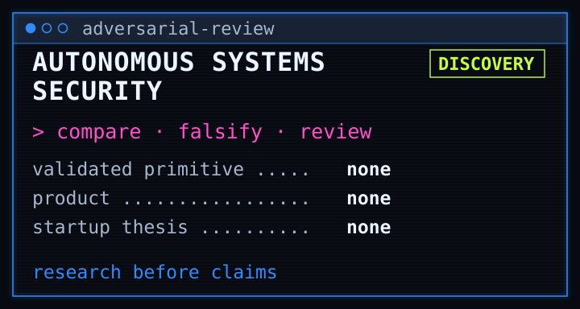

`DISCOVERY / ADVERSARIAL REVIEW`

I study security boundaries for increasingly autonomous action. The work compares proposed approaches with existing research and tools, and actively tries to falsify claims of novelty or protection.

It has not established a new security primitive, a validated product or a startup thesis. An interesting question is not yet a defensible contribution.

[`$ cat public/autonomous-systems-security-public-note.md`](public/autonomous-systems-security-public-note.md) — read the discovery note

  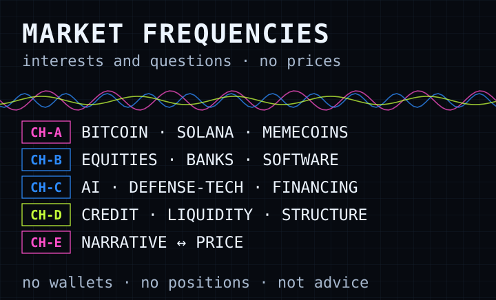

- **Crypto** — Bitcoin, Solana and memecoin culture, where liquidity, incentives, coordination and narrative collide.
- **Equities & companies** — banks, software, AI and defense-tech: how companies raise capital, build market power and create dependence.
- **Credit** — obligations, maturities, refinancing conditions, and the moment a financial problem starts to travel. The interest behind DebtWatch.
- **Liquidity & market structure** — who is on the other side of the trade, and what a price can actually tell you.
- **Narrative ↔ price** — why a story becomes believable, and what changes once money enters it.

*Interests and questions, not positions or advice. No wallets, balances or P&L live here.*

  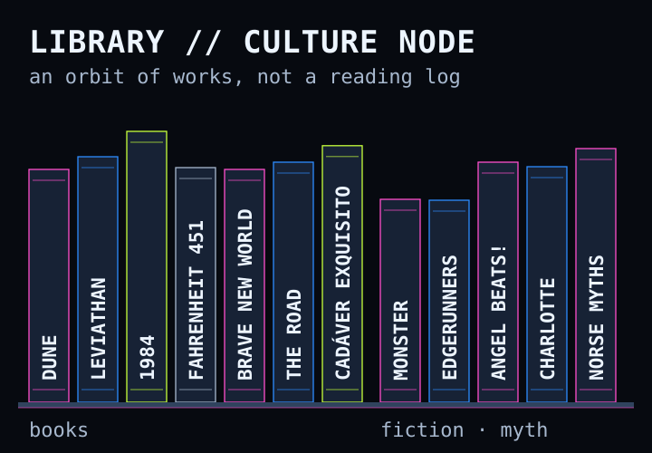

Works that orbit the questions above. Not a reading log: no "read", "completed" or ratings.

- **Dune** — power, religion, prescience and the cost of steering a future.
- **Leviathan** — authority, fear, order and sovereignty.
- **1984** — language, memory and control.
- **Cadáver exquisito** — normality, language and dehumanization.
- **Cyberpunk: Edgerunners** — identity, bodies, and systems bigger than any one person.

<b>More from the shelf</b>

 

- **Fahrenheit 451** — distraction, reading and conformity.
- **Brave New World** — desire, comfort and conditioning.
- **The Road** — moral continuity after institutions disappear.
- **Monster** — identity, responsibility, and what people become inside systems.
- **Angel Beats! / Charlotte** — memory, loss, bonds and personal continuity.
- **Norse mythology** — fate, transformation, and worlds that can also end.

  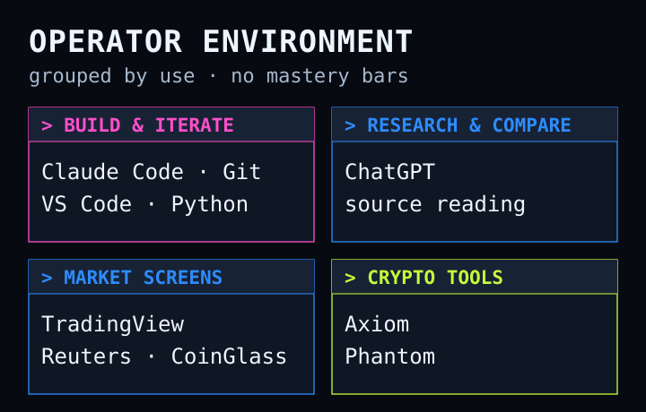

**Build & iterate** — Claude Code, Git, VS Code, Python. Most building happens in a terminal with agents: direct the task, compare answers, review the result, revise. 
**Research & compare** — ChatGPT, and a lot of source reading. 
**Market screens** — TradingView, Reuters, CoinGlass. 
**Crypto tools** — Axiom, Phantom.

*A tool I use is not a skill I claim to have mastered.*

  

Minecraft · Terraria · weird corners of the internet · technical rabbit holes · internet culture

`too many tabs, still one more question`

  

<a href="#research-index"><code>↑ back to the index</code></a>

